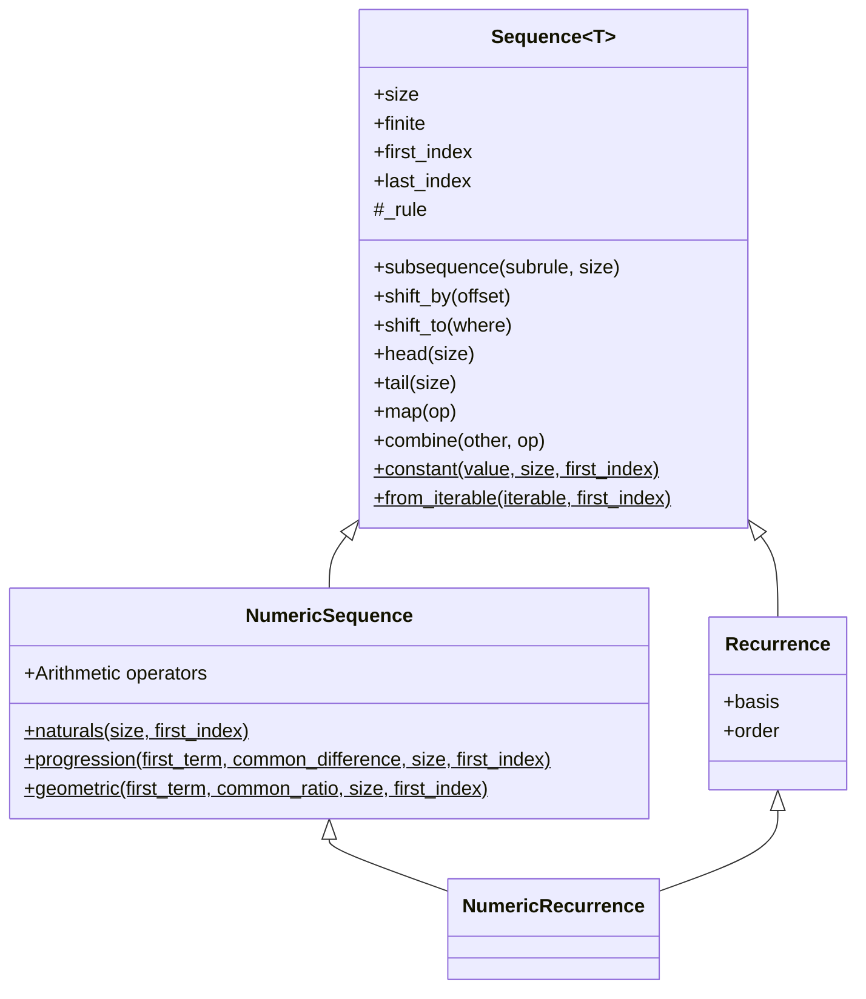

# Architecture

This document records the class hierarchy of the `calculus` package
and the relationships between its classes.

## Class diagram

## Notes

- `$` denotes a static method (a factory that does not operate on
  an existing instance).
- `NumericSequence`'s arithmetic operators are grouped rather than
  listed individually, since enumerating all fourteen dunder
  methods would add noise without adding information; see
  `numeric_sequence.py` for the complete list.
- `NumericRecurrence` inherits from both `Recurrence` and
  `NumericSequence`, combining numeric arithmetic with recursively
  defined elements.
