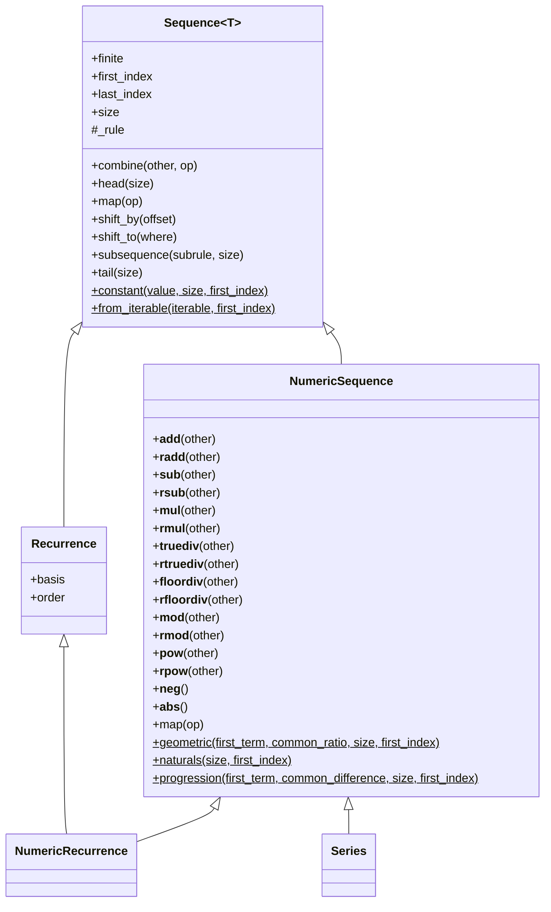

# Architecture

This document records the class hierarchy of the `calculus` package
and the relationships between its classes.

## Class diagram

## Notes

- `$` is used in this diagram to denote a static method. The static
  methods shown here are factory methods.
- `Sequence` is the base abstraction for sequences in the package.
- `NumericSequence` inherits from `Sequence` and implements arithmetic
  operators through Python's special methods.
- `Recurrence` inherits from `Sequence`, representing sequences defined
  by recursive relations.
- `NumericRecurrence` inherits from both `Recurrence` and
  `NumericSequence`, combining numeric arithmetic with recursively
  defined elements.
- `Series` inherits from `NumericSequence`, representing partial sums of
  an underlying term sequence.
